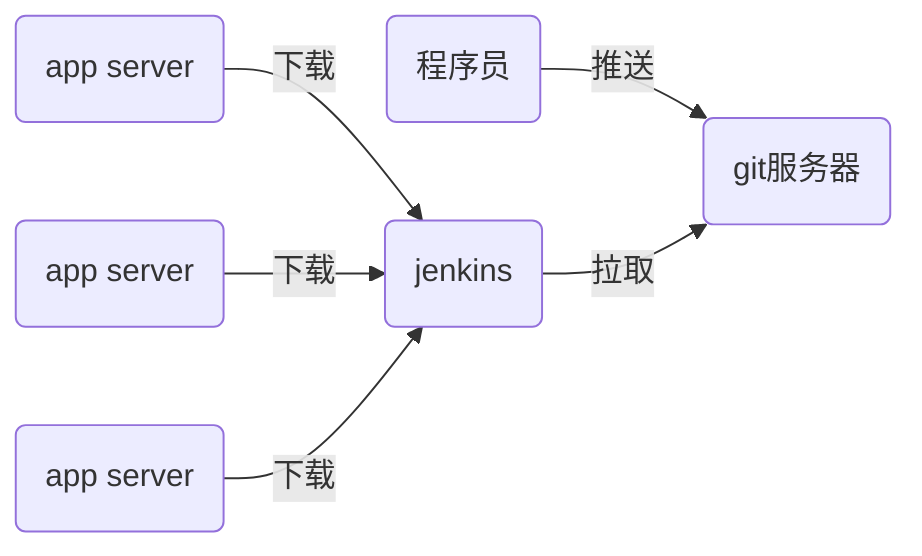

## CI/CD

- CI/CD：持续集成/持续交付（部署）



- 程序：
  - 解释执行：shell / python / php
  - 编译执行：c / go

## git

程序员通过git管理代码

```shell
[root@localhost nsd2019]# yum install -y git
[root@localhost nsd2019]# git config --global user.name "MrZhang"
[root@localhost nsd2019]# git config --global user.email "zhangzg@tedu.cn"
[root@localhost nsd2019]# git config --global core.editor vim  # 默认编辑器
[root@localhost nsd2019]# git config --list
[root@localhost nsd2019]# cat ~/.gitconfig 
```

git的工作区域

- 工作区：软件项目目录
- 暂存区：.git/index，是工作区与版本库间的缓冲地带
- 版本库：工作区下的.git目录


### git 应用

```shell
# 创建版本库方法一
[root@localhost ~]# git init mypro
初始化空的 Git 版本库于 /root/mypro/.git/
[root@localhost ~]# ls -A mypro/
.git

# 创建版本库方法二
[root@localhost ~]# mkdir myweb
[root@localhost ~]# cd myweb/
[root@localhost myweb]# echo '<h1>My Web Site</h1>' > index.html
[root@localhost myweb]# git init
初始化空的 Git 版本库于 /root/myweb/.git/
[root@localhost myweb]# ls -A
.git  index.html

# 初始化版本库，不会将文件存入版本库
[root@localhost myweb]# cp /etc/passwd .
[root@localhost myweb]# git status
[root@localhost myweb]# git status -s
?? index.html     # ??表示状态未知
?? passwd
[root@localhost myweb]# git add index.html   # 将指定文件加入到暂存区
[root@localhost myweb]# git status -s
A  index.html     # 表示文件已添加到暂存区
?? passwd
[root@localhost myweb]# git add .      # 将当前目录所有内容加入到暂存区
[root@localhost myweb]# git status -s
A  index.html
A  passwd

# 将文件从暂存区中撤出
[root@localhost myweb]# git rm --cached passwd
rm 'passwd'
[root@localhost myweb]# ls
index.html  passwd
[root@localhost myweb]# git status -s
A  index.html
?? passwd

# 通过.gitignore忽略不想加入到版本库的文件
[root@localhost myweb]# vim .gitignore
passwd
*.swp
.gitignore
[root@localhost myweb]# git status -s   # 不再显示passwd状态
A  index.html

# 提交文件到版本库
[root@localhost myweb]# git commit  # 跳出vim，不写入任何内容，直接退出，不会提交
[root@localhost myweb]# git status -s  # 文件仍然在暂存区
A  index.html
[root@localhost myweb]# git commit -m "first commit"  # 直接提交
[root@localhost myweb]# git status -s
[root@localhost myweb]# git status 
# 位于分支 master
无文件要提交，干净的工作区


# 查看版本库中的文件
[root@localhost myweb]# git ls-files
index.html
# 查看工作区中的文件
[root@localhost myweb]# ls
index.html  passwd

# 删除文件
[root@localhost myweb]# git rm index.html
rm 'index.html'
[root@localhost myweb]# git status -s
D  index.html    # D表示delete
[root@localhost myweb]# git status
# 位于分支 master
# 要提交的变更：
#   （使用 "git reset HEAD <file>..." 撤出暂存区）
#
#	删除：      index.html
#
[root@localhost myweb]# git reset HEAD index.html
[root@localhost myweb]# git checkout -- index.html
[root@localhost myweb]# ls
index.html  passwd
[root@localhost myweb]# git ls-files
index.html
[root@localhost myweb]# git status
# 位于分支 master
无文件要提交，干净的工作区


# 恢复误删除的文件
[root@localhost nsd2019]# pwd
/tmp/nsd2019
[root@localhost nsd2019]# du -sh .
232M	.
[root@localhost nsd2019]# du -sh .git
83M	.git
[root@localhost nsd2019]# rm -rf *
[root@localhost nsd2019]# ls -A
.git  .gitignore
[root@localhost nsd2019]# du -sh
83M	.
[root@localhost nsd2019]# git status | more
# 位于分支 master
# 尚未暂存以备提交的变更：
#   （使用 "git add/rm <file>..." 更新要提交的内容）
#   （使用 "git checkout -- <file>..." 丢弃工作区的改动）
#
#	删除：      README.md
[root@localhost nsd2019]# git checkout -- *
[root@localhost nsd2019]# ls
[root@localhost nsd2019]# du -sh .
232M	.


# 删除版本库中的文件
[root@localhost myweb]# git ls-files
index.html
[root@localhost myweb]# ls
index.html  passwd
[root@localhost myweb]# git rm index.html
rm 'index.html'
[root@localhost myweb]# git commit -m "delete index.html"
[root@localhost myweb]# ls
passwd
[root@localhost myweb]# git status
# 位于分支 master
无文件要提交，干净的工作区
[root@localhost myweb]# git ls-files   # 版本库中也已经没有index.html了

# 查看日志
[root@localhost myweb]# git log
commit e6ea007564e9b113e62741247c3c595dd34d8202
Author: MrZhangzhg <zhangzg@tedu.cn>
Date:   Tue Feb 25 11:29:13 2020 +0800

    delete index.html

commit 2293660c978ce857b0a6d9d29fae59cf7d4fa9a7
Author: MrZhangzhg <zhangzg@tedu.cn>
Date:   Tue Feb 25 10:41:30 2020 +0800

    first commit

# checkout到以前的某个状态
[root@localhost myweb]# ls   # 工作区中出现index.html
index.html  passwd
# 返回到master分支最新状态
[root@localhost myweb]# git checkout master
之前的 HEAD 位置是 2293660... first commit
切换到分支 'master'
[root@localhost myweb]# ls   # 工作区中没有index.html
passwd


# 改名
[root@localhost myweb]# cp /etc/hosts .
[root@localhost myweb]# git add .
[root@localhost myweb]# git commit -m "add hosts"
[root@localhost myweb]# git mv hosts zhuji
[root@localhost myweb]# git status -s
R  hosts -> zhuji    # rename
[root@localhost myweb]# git commit -m "mv hosts zhuji"
[root@localhost myweb]# git ls-files
zhuji
[root@localhost myweb]# ls
passwd  zhuji
```

### 分支管理

- git中有一个默认的分支叫master

```shell
[root@localhost myweb]# git branch
* master
```

- 当需要把某一个需求交给某人处理时，就可以创建一个新的分支，代码在分支中完成。当分支功能完成后，可以再汇入主干

```shell
# 创建分支b1
[root@localhost myweb]# git branch b1
[root@localhost myweb]# git branch 
  b1
* master   # 有*号的，表示当所处分支
# 在master分支上提交代码
[root@localhost myweb]# cp /etc/shadow .
[root@localhost myweb]# git add .
[root@localhost myweb]# git commit -m "add shadow"
[root@localhost myweb]# ls
passwd  shadow  zhuji
# 在b1分支提交代码
[root@localhost myweb]# git checkout b1   # 切换分支
[root@localhost myweb]# git branch 
* b1
  master
[root@localhost myweb]# ls   # 没有shadow文件
passwd  zhuji
[root@localhost myweb]# cp /etc/issue .
[root@localhost myweb]# git add .
[root@localhost myweb]# git commit -m "add issue"
[root@localhost myweb]# ls
issue  passwd  zhuji
# 将b1分支汇入到主干master
[root@localhost myweb]# git checkout master
[root@localhost myweb]# ls
passwd  shadow  zhuji
[root@localhost myweb]# git merge b1 -m "Merge branch b1"
[root@localhost myweb]# ls
issue  passwd  shadow  zhuji
[root@localhost myweb]# git branch -d b1   # 删除不需要的分支
[root@localhost myweb]# git branch 
* master
```

### 标记

```shell
# 可以为某一次commit打一个标记，如作为版本号
[root@localhost myweb]# git tag   # 查看标记
[root@localhost myweb]# git tag 1.0  # 打标记
[root@localhost myweb]# git tag
1.0
[root@localhost myweb]# cp /etc/motd .
[root@localhost myweb]# git add .
[root@localhost myweb]# git commit -m "add motd"
[root@localhost myweb]# git tag 2.0
[root@localhost myweb]# git tag
1.0
2.0
```

## gitlab

git服务器有很多种类型，如github / gitlab / gogs / gitee等

```shell
# 安装docker并启动
# 导入gitlab镜像
[root@localhost images]# docker load -i gitlab_zh.tar 
[root@localhost images]# docker images

# 修改主机的ssh端口号
Port 2022
[root@localhost ~]# systemctl restart sshd
[root@localhost ~]# ssh -p2022 192.168.113.135

# 启动容器
[root@localhost ~]# docker run -d -h gitlab --name gitlab -p 443:443 -p 80:80 -p 22:22 --restart always -v /srv/gitlab/config:/etc/gitlab -v /srv/gitlab/logs:/var/log/gitlab -v /srv/gitlab/data:/var/opt/gitlab gitlab_zh:latest 
# 查看状态，当状态成为healthy时，才完全可用
[root@localhost ~]# docker ps -a
```

当gitlab容器启动之后，访问它的主页。第一次访问需要为root用户设置密码，密码必须符合复杂度要求，够长，如1234.com。http://x.x.x.x

gitlab中重要的几个概念

- 用户：使用gitlab的人
- 群组：可以对应开发团队
- 项目：对应开发的项目。可以为个人创建项目，也可以为团队创建项目

创建用户时，不能设置密码，但是可以创建用户后，编辑他，这个时候就可以更改密码了。

创建名为devops的组并将用户加入到组中。群组类型选：公开。新用户加入到组中的身份是：主程序员。

创建名为myweb的项目，项目为devops组创建，可见等级为公开。因为项目是为devops组创建的，所以devops组的成员，都可以访问该项目。如果需要添加额外成员，可以点击左边栏的设置->成员进行添加。

### 上传代码

切换成创建的普通用户。普通用户第一次登陆时，需要改密码，可以改成与之前一样的密码。

在程序员的机器上将myweb项目推送到gitlab服务器

```shell
# 添加仓库，将仓库与url关联
[root@localhost myweb]# git remote add origin \
http://192.168.113.135/devops/myweb.git
# 推送代码到gitlab服务器，需要填写用户名、密码。注意，这不会推送tag
[root@localhost myweb]# git push -u origin --all
Username for 'http://192.168.113.135': zzg
Password for 'http://zzg@192.168.113.135': 
# 在gitlab上的仓库页面刷新，可以看到推送上来的代码，但是“标签”显示为0。另外工作区中的passwd因为写入到了.gitigore中，它是被忽略的。上传是将版本库上传，不是工作区。
# 推送标签到gitlab
[root@localhost myweb]# git push -u origin --tags
Username for 'http://192.168.113.135': zzg
Password for 'http://zzg@192.168.113.135': 
# 在gitlab上刷新，可以看到标签。
```

使用ssh免密上传代码

```shell
# 在程序员的主机上创建密钥对
[root@localhost myweb]# ssh-keygen -C "zzg@tedu.cn"
[root@localhost myweb]# cat ~/.ssh/id_rsa.pub 
# 复制公钥内容
```

在gitlab页面的右上角点击用户图标->设置->窗口左边栏ssh密钥。将复制的公钥信息粘贴到密钥文本框中。

修改git仓库上传代码的方式。

点击项目，获取项目ssh url。

```shell
# 修改程序员主机上的地址
[root@localhost myweb]# cat .git/config 
[root@localhost myweb]# git remote remove origin
[root@localhost myweb]# cat .git/config 
[root@localhost myweb]# git remote add origin \
git@192.168.113.135:devops/myweb.git
[root@localhost myweb]# cat .git/config 

# 上传测试
[root@localhost myweb]# vim README.md
# 我的测试项目
​```python
>>> print("Hello World!")
​```
- 本项目仅用于演示使用
- 可以通过http下载
- 也可以通过ssh上传下载
[root@localhost myweb]# git add .
[root@localhost myweb]# git commit -m "add readme.md"
[root@localhost myweb]# git push 
```


