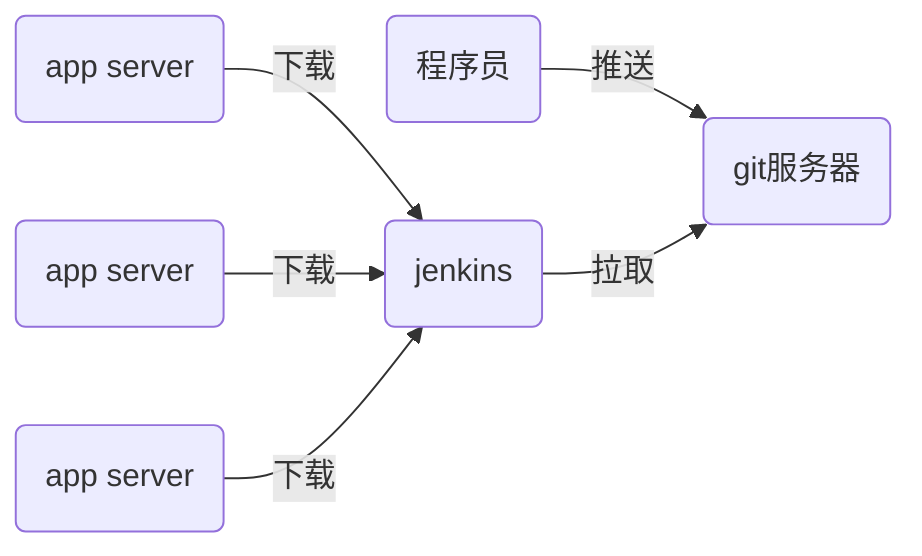

## ci/cd流程



## jenkins配置与使用

```shell
# rpm -ihv jenkins-xxxx.rpm
[root@localhost ~]# systemctl start jenkins
[root@localhost ~]# systemctl enable jenkins
```

配置：http://192.168.113.133:8080 -> 解锁 -> 选择插件来安装 -> 点击“无” -> 点击右下角的“使用admin账户继续登陆” -> 保存并完成 -> 开始使用jenkins

修改admin密码：右上角admin -> 左侧边栏configure -> 找到password并修改

配置使用国内镜像站点安装插件：点击左上角的Jenkins -> 左边栏Manage Jenkins -> Manage Plugins -> Advanced -> Update Site ：https://mirrors.tuna.tsinghua.edu.cn/jenkins/updates/update-center.json -> submit

安装中文插件、git插件：在Manage Plugins页面中点击Available标签 -> ctrl + f 搜索找到并勾选Localization: Chinese(Simplified)和Git Parameter -> Install without restart按钮 -> 勾选 Restart Jenkins ...复选框。

> 清华大学插件镜像地址：https://mirrors.tuna.tsinghua.edu.cn/jenkins/plugins/
>
> 可以自行搜索下载后，手动上传安装

## 在gitlab上拉取代码

#### 新建项目：

新建Item -> 任务名:mk_myweb；Freestyle project -> This project is parameterized(参数化构建过程) > 添加参数 > git parameter(git参数) > Name: webver / Parameter Type: Branch or Tag / Default Value: origin/master -> 源码管理 > Git > Repository URL > http://192.168.113.135/devops/myweb.git(注意：需要jenkins服务器已经安装了git，即yum install git) / Branches to build: $webver -> 保存

#### 构建项目：

左边栏Build with Parameters -> 选一个版本，如1.0 -> 开始构建(观察左下角的构建历史，如果结果蓝球则正常，如果是红球表示失败) -> 点击左下角蓝球的#1 -> 控制台输出 -> 查看jenkins的/var/lib/jenkins/workspace目录

```shell
[root@localhost ~]# ls /var/lib/jenkins/workspace/
mk_myweb
```

#### 修改项目：每次构建下载的代码放到不同目录

点击项目 -> 配置 -> Additional Behaviours > 新增 > Check out to a sub-directory: myweb-$webver 保存

构建测试。测试前，先删除/var/lib/jenkins/workspace/mk_myweb目录。构建两个版本查看：

```shell
[root@localhost ~]# ls /var/lib/jenkins/workspace/mk_myweb/
myweb-1.0  myweb-2.0
```

#### 修改项目

规划：

1. 为了方便最终的应用服务器从jenkins上下载编译好的软件，可以在jenkins上安装httpd
2. httpd的目录规划
   1. /var/www/html/deploy/pkgs/：用于保存各版本的压缩包和它们的md5值
      - /var/www/html/deploy/pkgs/myweb-1.0.tar.gz
      - /var/www/html/deploy/pkgs/myweb-1.0.tar.gz.md5
      - /var/www/html/deploy/pkgs/myweb-2.0.tar.gz
      - /var/www/html/deploy/pkgs/myweb-2.0.tar.gz.md5
   2. /var/www/html/deploy/live_ver：用于保存最新版本号，如2.0
   3. /var/www/html/deploy/last_ver：用于保存前一版本号，如1.0

在jenkins服务器上配置web服务

```shell
[root@localhost ~]# yum install -y httpd
[root@localhost ~]# systemctl start httpd
[root@localhost ~]# systemctl enable httpd
[root@localhost ~]# mkdir -p /var/www/html/deploy/pkgs
[root@localhost ~]# chown -R jenkins.jenkins /var/www/html/deploy
```

点击项目 -> 配置 -> 构建 > 增加构建步骤 > Excute shell > 命令文本框中填入以下内容：

```shell
# 创建变量app_dir，表示压缩包目录
app_dir=/var/www/html/deploy/pkgs
cp -r myweb-$webver $app_dir  # 拷贝应用程代码目录到app_dir
cd $app_dir   # 切换目录
rm -rf myweb-$webver/.git  # 删除版本库文件，因为线上服务器不需要
tar czf myweb-$webver.tar.gz myweb-$webver  # 将应用目录打包
rm -rf myweb-$webver    # 删除应用目录
# 计算压缩包的md5值
md5sum myweb-$webver.tar.gz | awk '{print $1}' > myweb-$webver.tar.gz.md5
cd ..
# 如果live_ver文件存在，把这的内容写到last_ver中
[ -f live_ver ] && cat live_ver > last_ver
echo -n $webver > live_ver   # 把当前的版本号写到live_ver
```

## 编写自动上线代码

### 将web应用上线

1. 安装httpd

```shell
[root@localhost www]# yum install -y httpd
[root@localhost www]# systemctl start httpd
[root@localhost www]# systemctl enable httpd
```

2. 手工上线代码：查看最新版本http://192.168.113.133/deploy/live_ver；下载最新版本的软件包http://192.168.113.133/deploy/pkgs/myweb-1.0.tar.gz；校验下载的软件包是否损坏；如果软件包完好，则部署
3. 部署方式
   - /var/www/download/：用于保存下载的软件压缩包
   - /var/www/deploy/：用于保存解压目录
   - /var/www/deploy/live_ver：保存当前部署的版本
   - /var/www/html/nsd1909：指向deploy中生效版本目录的链接文件

```shell
[root@localhost www]# mkdir /var/www/{deploy,download}
```

4. 编写自动上线代码

```python
import os
import requests
import wget
import hashlib
import tarfile

def has_new_ver(ver_fname, ver_url):
    '用于检查是否有新版本，有返回真，没有返回假'
    # 如果本地没有版本文件，则有新版本
    if not os.path.isfile(ver_fname):
        return True

    # 如果本地版本号与网上版本号不一样，则有新版本
    with open(ver_fname) as fobj:
        local_ver = fobj.read()   # 从本地文件中读取本地版本号

    r = requests.get(ver_url)     # 获取网上的版本号
    if local_ver != r.text:
        return True
    else:
        return False

def file_ok(md5_url, app_fname):
    '用于检查文件是否完好，完好为真，否则为假'
    # 计算本地文件的md5值
    m = hashlib.md5()
    with open(app_fname, 'rb') as fobj:
        while 1:
            data = fobj.read(4096)
            if not data:
                break
            m.update(data)

    # 比较本地文件的md5值和网上给出的md5值
    r = requests.get(md5_url)
    if m.hexdigest() == r.text.strip():  # 网上文件的md5值尾部可能有\n，去除它
        return True
    else:
        return False

def deploy(app_fname, deploy_dir, dest):
    # 解压缩
    tar = tarfile.open(app_fname)
    tar.extractall(path=deploy_dir)
    tar.close()

    # 拼接解压文件的绝对路径
    app_dir = os.path.basename(app_fname)
    app_dir = app_dir.replace('.tar.gz', '')
    app_dir = os.path.join(deploy_dir, app_dir)

    # 目标软链接文件如果存在，则删除
    if os.path.exists(dest):
        os.remove(dest)

    # 创建链接文件
    os.symlink(app_dir, dest)

if __name__ == '__main__':
    # 检查是否有新版本
    ver_fname = '/var/www/deploy/live_ver'
    ver_url = 'http://192.168.113.133/deploy/live_ver'
    if not has_new_ver(ver_fname, ver_url):
        print('未发现新版本')
        exit(1)

    # 下载新版本压缩包
    down_dir = '/var/www/download'
    r = requests.get(ver_url)
    app_url = 'http://192.168.113.133/deploy/pkgs/myweb-%s.tar.gz' % r.text
    wget.download(app_url, down_dir)

    # 校验下载的压缩包是否损坏，如果损坏则删除它
    md5_url = app_url + '.md5'   # 拼接md5的url
    app_fname = app_url.split('/')[-1]
    app_fname = os.path.join(down_dir, app_fname)  # 拼接本地文件的绝对路径
    if not file_ok(md5_url, app_fname):
        print('文件已损坏')
        os.remove(app_fname)
        exit(2)

    # 部署软件
    deploy_dir = '/var/www/deploy'
    dest = '/var/www/html/nsd1909'
    deploy(app_fname, deploy_dir, dest)

    # 更新本地版本文件
    if os.path.exists(ver_fname):
        os.remove(ver_fname)
    wget.download(ver_url, ver_fname)

    print('上线完成')

```

5. 验证

```shell
# 程序员编写新版本代码，推送到服务器
[root@localhost ~]# cd ~/myweb/
[root@localhost myweb]# echo '<h1>My Web Site</h1>' > index.html
[root@localhost myweb]# git add .
[root@localhost myweb]# git commit -m "myweb 3.0"
[root@localhost myweb]# git tag 3.0
[root@localhost myweb]# git push
[root@localhost myweb]# git push --tags


# 通过jenkins构建最新版本的代码
# 运行deploy_app.py实现代码自动上线
# 访问http://web_server/nsd1909


# 上线4.0
# 程序员编写新版本代码，推送到服务器
[root@localhost ~]# cd ~/myweb/
[root@localhost myweb]# vim index.html    # 写入以下内容
<h1>My Web Site</h1>

[root@localhost myweb]# git add .
[root@localhost myweb]# git commit -m "myweb 4.0"
[root@localhost myweb]# git tag 4.0
[root@localhost myweb]# git push
[root@localhost myweb]# git push --tags
# 通过jenkins构建最新版本的代码
# 运行deploy_app.py实现代码自动上线
# 访问http://web_server/nsd1909
```


