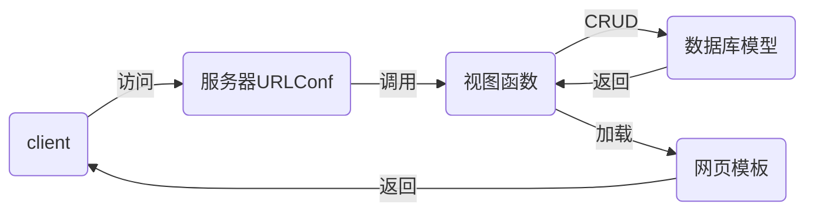

## django

- django是一个开源的web框架。其他框架还有flask、tornado
- 安装

```shell
[root@localhost day02]# pip3 install django==
[root@localhost day02]# pip3 install django==1.11.6
```

- MTV设计模式
  - Model：模型，对应数据库
  - Template：模板，对应html网页文件
  - View：视图，对应函数



## django配置

```shell
# 创建django项目方法一：
[root@localhost day03]# django-admin startproject mytest
[root@localhost day03]# ls
mytest

# 创建项目方法二，通过pycharm创建：
# File -> New Project ->在左窗格中选择Django，右窗格写入/xxx/xxx/mysite

[root@localhost mysite]# tree .
.                            # 外层的mysite是项目的根目录
├── manage.py                # 项目的管理文件
├── mysite                   # 内层mysite是配置目录
│   ├── __init__.py          # 初始化文件
│   ├── settings.py          # 配置文件
│   ├── urls.py              # 路由文件
│   └── wsgi.py              # 架设项目到web服务器时的配置文件
└── templates                # 网页模板文件目录

# 启动测试服务器(django为了方便程序员测试代码，它内建了一个web服务器，该服务器不能用于生产环境，生产环境应该将django网站架设在nginx web服务器上)
[root@localhost mysite]# python3 manage.py runserver
# 访问http://127.0.0.1:8000

# 创建mysql数据库
[root@localhost nsd2019]# mysql -uroot -ptedu.cn
MariaDB [(none)]> CREATE DATABASE dj1909 DEFAULT CHARSET utf8;
# 配置初始化文件，使其可以使用mysql数据库连接
# mysite/__init__.py
import pymysql

pymysql.install_as_MySQLdb()

# 修改配置文件
# mysite/settings.py
ALLOWED_HOSTS = ['*']    # 允许所有主机访问服务器的任意地址
DATABASES = {            # 配置到mysql数据库的连接
    'default': {
        'ENGINE': 'django.db.backends.mysql',
        'NAME': 'dj1909',
        'USER': 'root',
        'PASSWORD': 'tedu.cn',
        'HOST': '127.0.0.1',
        'PORT': '3306',
    }
}
LANGUAGE_CODE = 'zh-hans'  # 语言改为中文
TIME_ZONE = 'Asia/Shanghai'
USE_TZ = False

# 重启开发服务器，先按ctrl+c停止开发服务器，然后执行下面的命令，使开发服务器运行在0.0.0.0:80
[root@localhost mysite]# python3 manage.py runserver 0:80


# 生成django默认应用的数据库表
[root@localhost mysite]# python3 manage.py makemigrations
[root@localhost mysite]# python3 manage.py migrate

# 创建项目管理员用户
[root@localhost mysite]# python3 manage.py createsuperuser
Username (leave blank to use 'root'): admin
Email address: admin@tedu.cn
Password: 1234.com
Password (again): 1234.com
Superuser created successfully.

# 访问后台管理页面http://127.0.0.1/admin/
```

## 应用

- 应用是一个功能模块
- 一个网站可以由一到多个应用构成
- 一个应用可以集成到多个项目中

### 创建投票应用

> 将上个班的投票项目启动
>
> ```shell
> [root@localhost nsd2019]# cd nsd1908/devweb/day0304/mysite/
> [root@localhost mysite]# mysql -uroot -ptedu.cn
> MariaDB [(none)]> CREATE DATABASE nsd1908 DEFAULT CHARSET utf8;
> [root@localhost mysite]# rm -rf polls/migrations/*
> [root@localhost mysite]# touch polls/migrations/__init__.py
> [root@localhost mysite]# python3 manage.py makemigrations
> [root@localhost mysite]# python3 manage.py migrate
> [root@localhost mysite]# python3 manage.py createsuperuser
> Username (leave blank to use 'root'): admin
> Email address: admin@tedu.cn
> Password: 
> Password (again): 
> Superuser created successfully.
> [root@localhost mysite]# python3 manage.py runserver
> # 访问http://127.0.0.1:8000/polls
> # 访问http://127.0.0.1:8000/admin，可以在后台添加问题和选项
> ```

- 投票应用规划
  - http://x.x.x.x/polls/：投票首页，用于显示所有的投票项
  - http://x.x.x.x/polls/1/：1号问题的投票详情页，可以在该页面进行投票
  - http://x.x.x.x/polls/1/result/：1号问题的投票结果

```python
# 创建应用
[root@localhost mysite]# python3 manage.py startapp polls
[root@localhost mysite]# ls
db.sqlite3  manage.py  mysite  polls  templates

# 创建应用，并没有把它集成到项目
# 集成应用到项目
# mysite/settings.py
INSTALLED_APPS = [
    ... ...
    'polls',
]

# 如果把所有的url与函数对应关系放到一个文件中，将会非常难于维护。为了方便维护，应该将应用的url授权给应用管理
# mysite/urls.py
from django.conf.urls import url, include
from django.contrib import admin

urlpatterns = [
    url(r'^admin/', admin.site.urls),
    # 从http://x.x.x.x/后面开始匹配
    url(r'^polls/', include('polls.urls')),
]

# 创建polls/urls.py
from django.conf.urls import url

urlpatterns = []
```

#### 制作投票首页

```python
# 创建url与函数的映射
# polls/urls.py
from django.conf.urls import url
from polls import views


urlpatterns = [
    # 如果访问投票首页，则使用views.index函数响应。为该url起名为index。
    # url正则匹配时，从http://x.x.x.x/polls/后面开始匹配
    url(r'^$', views.index, name='index'),
]

# 创建index函数
# polls/views.py
from django.shortcuts import render

# 用户发来的请求，将会作为第一个参数传给函数，所以需要用一个变量来接收
def index(request):
    # 通过render函数找到名为index.html的模板文件，返回给用户
    return render(request, 'index.html')

# 创建templates/index.html
<!DOCTYPE html>
<html lang="en">
<head>
    <meta charset="UTF-8">
    <title>投票首页</title>
</head>
<body>
<h1>投票首页</h1>
</body>
</html>

# 重启开发服务器，进行访问 http://x.x.x.x/polls/
```

#### 制作投票详情页

```python
# polls/urls.py
from django.conf.urls import url
from polls import views


urlpatterns = [
    # 如果访问投票首页，则使用views.index函数响应。为该url起名为index。
    # url正则匹配时，从http://x.x.x.x/polls/后面开始匹配
    url(r'^$', views.index, name='index'),
    # 正则后面的/必须写上，用户输入网址时不必输入/
    # \d+匹配至少一个数字，用()括起来，这个数字将会成为detail的参数
    url(r'^(\d+)/$', views.detail, name='detail'),
]

# polls/views.py
from django.shortcuts import render

# 用户发来的请求，将会作为第一个参数传给函数，所以需要用一个变量来接收
def index(request):
    # 通过render函数找到名为index.html的模板文件，返回给用户
    return render(request, 'index.html')

def detail(request, q_id):
    # url上的数字，将会作为参数传递给q_id
    # 字典内容将会以key=val的形式传给detail.html，detail.html就可以拥有变量了
    return render(request, 'detail.html', {'q_id': q_id})

# templates/detail.html
<!DOCTYPE html>
<html lang="en">
<head>
    <meta charset="UTF-8">
    <title>问题详情</title>
</head>
<body>
<h1>{{ q_id }}号问题投票详情</h1>
</body>
</html>

# 测试，访问http://x.x.x.x/polls/1
```

#### 制作投票结果页

```python
# polls/urls.py
from django.conf.urls import url
from polls import views


urlpatterns = [
    # 如果访问投票首页，则使用views.index函数响应。为该url起名为index。
    # url正则匹配时，从http://x.x.x.x/polls/后面开始匹配
    url(r'^$', views.index, name='index'),
    # 正则后面的/必须写上，用户输入网址时不必输入/
    # \d+匹配至少一个数字，用()括起来，这个数字将会成为detail的参数
    url(r'^(\d+)/$', views.detail, name='detail'),
    url(r'^(\d+)/result/$', views.result, name='result'),
]

# polls/views.py
... ...
def result(request, q_id):
    return render(request, 'result.html', {'q_id': q_id})

# templates/result.html
<!DOCTYPE html>
<html lang="en">
<head>
    <meta charset="UTF-8">
    <title>投票结果</title>
</head>
<body>
<h1>{{ q_id }}号问题投票结果</h1>
</body>
</html>

# 测试，访问http://x.x.x.x/polls/1/result
```

### 配置Model模型

- Model对应数据库
- 采用ORM
  - Object：对象
  - Relationship：关系
  - Mapper：映射
  - 将django的class与数据库的表映射
  - class的类变量与表的字段映射
  - class的实例与表的记录映射
  - 数据库中的数据类型与django的一些类映射
- 投票应用需要创建两张表（两个模型）
  - 问题Question：问题id、问题内容、发布时间
  - 选项Choice：选项id、选项内容、选项票数、问题id

```python
# polls/models.py
from django.db import models

# 创建实体类，必须继续于models.Model
class Question(models.Model):
    question_text = models.CharField(max_length=200)
    pub_date = models.DateTimeField()

# 生成表
[root@localhost mysite]# python3 manage.py makemigrations
[root@localhost mysite]# python3 manage.py migrate

# 分析表
MariaDB [dj1909]> show tables;
... ...
| polls_question             |
... ...
MariaDB [dj1909]> desc polls_question;
# 分析结果
# 表名构成：1.全部采用小写字母；2.名称=应用名_类名
# 字段：1.没有明确创建主键，django自动创建了一个名为id的主键；2.类变量成为了字段名

# 将模型注册到后台管理界面
# polls/admin.py
from django.contrib import admin
from polls.models import Question

admin.site.register(Question)
# 访问http://x.x.x.x/admin
# 在后台添加问题时，问题都显示为Question object，使用下面的方法修正它：
# polls/models.py
from django.db import models

# 创建实体类，必须继续于models.Model
class Question(models.Model):
    question_text = models.CharField(max_length=200)
    pub_date = models.DateTimeField()

    def __str__(self):
        return "问题:%s" % self.question_text
# 访问http://x.x.x.x/admin再查看添加的问题

# 创建选项模型
# polls/models.py
... ...
class Choice(models.Model):
    choice_text = models.CharField(max_length=200)
    votes = models.IntegerField(default=0)  # 票数，默认为0
    q = models.ForeignKey(Question)

    def __str__(self):
        return "%s:%s" % (self.q, self.choice_text)

# 生成表
[root@localhost mysite]# python3 manage.py makemigrations
[root@localhost mysite]# python3 manage.py migrate

# 注册到后台管理界面
# polls/admin.py
from django.contrib import admin
from polls.models import Question, Choice

admin.site.register(Question)
admin.site.register(Choice)

# 分析表结构
# 在polls_choice表中有一个字段为q_id。在Choice模型中，外键类变量名为q，数据库表中将创建q_id外键字段。如果将Choice模型的q改为question，那么polls_choice表中的外键字段名字也会相应的变为question_id。
# polls/models.py
... ...
class Choice(models.Model):
    choice_text = models.CharField(max_length=200)
    votes = models.IntegerField(default=0)  # 票数，默认为0
    question = models.ForeignKey(Question)

    def __str__(self):
        return "%s:%s" % (self.question, self.choice_text)
# 生成数据库表
[root@localhost mysite]# python3 manage.py makemigrations
Did you rename choice.q to choice.question (a ForeignKey)? [y/N] y
[root@localhost mysite]# python3 manage.py migrate
MariaDB [dj1909]> desc polls_choice;
```

> 注意：在操作数据库时，务必通过Model模型进行，不要直接对数据库表做改动。


